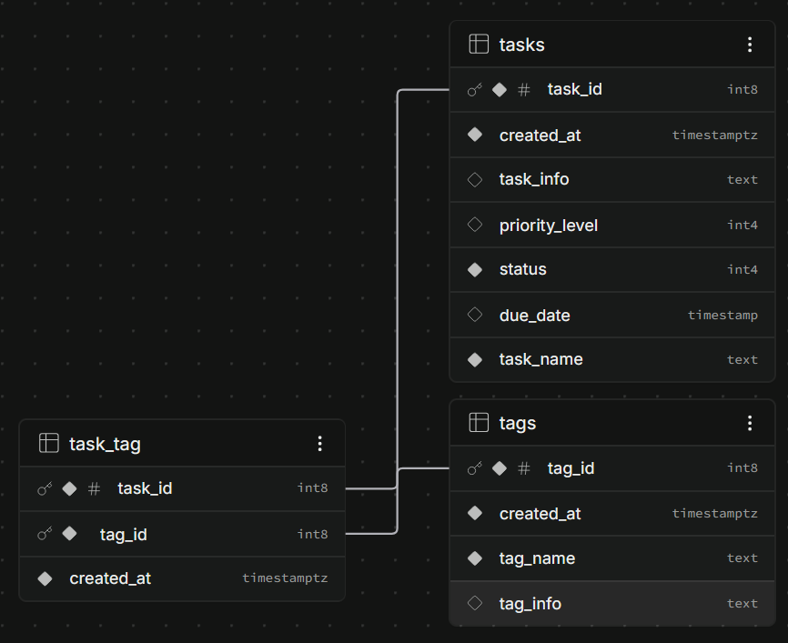

### Preliminary
Create a `.env` file in `/backend` with `SUPABASE_URL` and `SUPABASE_ANON_KEY` (or `SUPABASE_KEY`) to ensure that backend fetches data properly.
___
### 1. Run the following in `/backend` terminal:  
```bash
npm install express cors dotenv @supabase/supabase-js
```
- `express`: handles app routing, process incoming HTTP requests, and sends responses back
- `cors`: ensures frontend (Vite/React) can communicate with backend
- `dotenv`: loads environment variables from `.env` file into Node's `process.env`
- `@supabase/supabase-js`: official JavaScript client library to Supabase
___
### 2. To start the backend server:
```bash
node app.js
```
or
```bash
npm start
```
___
### 3. Run the following in `/frontend` terminal:  
```bash
npm install axios
```
- `axios`: acts as the HTTP client that communicates with external web server (Supabase)

### Database Schema/ERD
