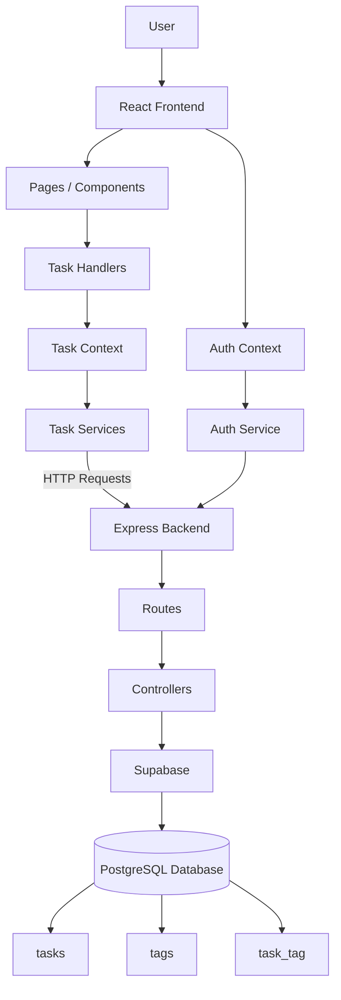
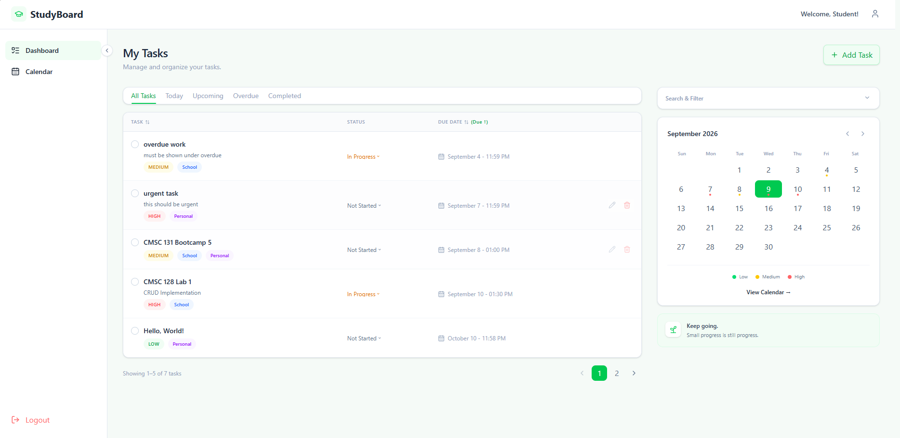
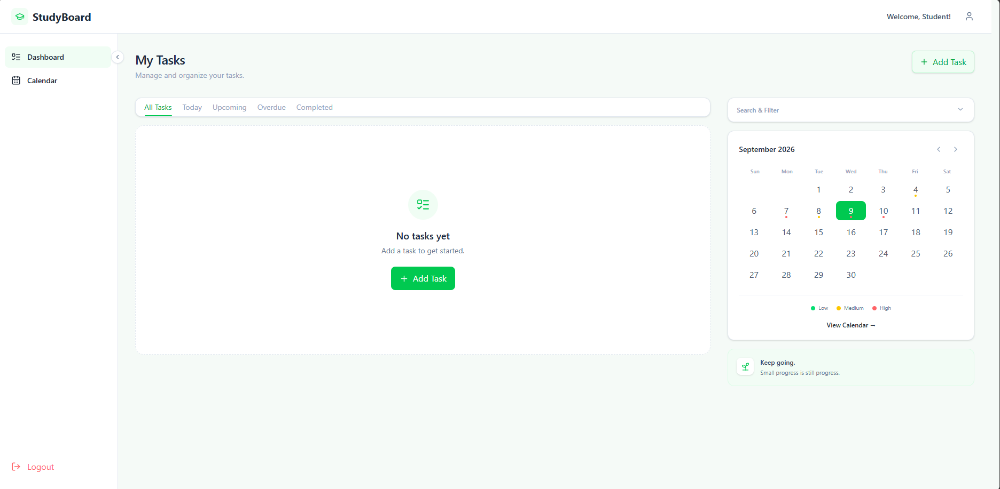
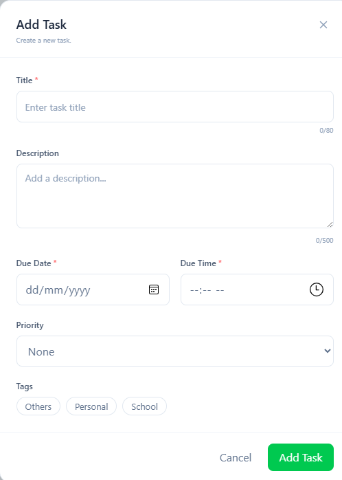
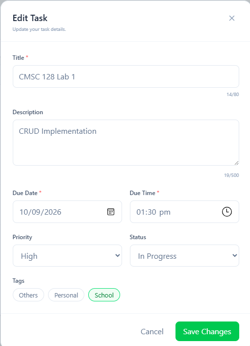
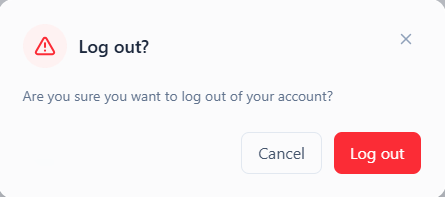
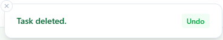
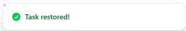
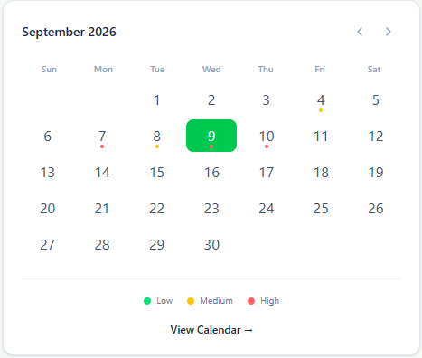
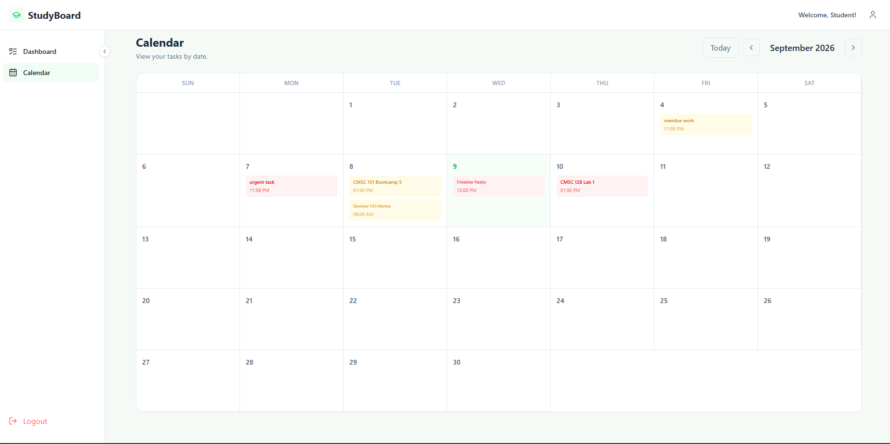

# Takda

Takda is a web-based task management application developed for **CMSC 128 – Software Engineering**. It helps students organize schoolwork, deadlines, and everyday tasks through task management, filtering, sorting, calendar views, and user accounts.

The application uses a React frontend, an Express backend, and Supabase PostgreSQL for persistent data storage.

---

## Features

### Task Management
* Add tasks with:
  * Title
  * Description
  * Due date and time
  * Priority
  * Tags
* View all tasks
* Edit tasks
* Delete tasks with confirmation
* Undo recently deleted tasks
* Mark tasks as completed
* Change task status
* Search tasks
* Filter tasks by category, status, priority, and tag
* Sort tasks by title, priority, due date, and date added
* Calendar view
* Pagination
* Persistent task data
* Completed tasks remain visible and are visually distinguished

### Authentication
* User registration
* User login
* Password visibility controls
* Password confirmation during registration
* Form validation and error feedback
* Session persistence across page refreshes
* Protected application routes
* Logout with confirmation
* Profile page
* Account information display
* Forgot password navigation
* Privacy Policy

### Notifications
* View task-related notifications
* Display task activity and relevant reminders through the Notifications page

### Appearance
* Light and dark themes
* Persistent theme preference
* Responsive layouts for desktop, tablet, and mobile devices
* Desktop sidebar navigation
* Mobile bottom navigation

---

## Tech Stack

### Frontend

* **React** – builds the user interface using reusable components
* **Vite** – development server and build tool
* **Tailwind CSS** – provides utility classes for styling
* **@tailwindcss/vite** – integrates Tailwind CSS with Vite
* **React Router** – handles application routing
* **Axios** – communicates with the backend API
* **Lucide React** – provides interface icons
* **Sonner** – provides toast notifications and user feedback

### Backend

* **Node.js** – JavaScript runtime
* **Express.js** – handles API routes and HTTP requests
* **CORS** – allows communication between the frontend and backend
* **dotenv** – loads environment variables from `.env`

### Database

* **Supabase / PostgreSQL** – provides persistent data storage

---

## Project Architecture
Takda follows a frontend-backend architecture where the React frontend communicates with the Express backend through REST API endpoints. The backend handles application logic and communicates with Supabase for persistent data storage and authentication.



### CRUD Data Flow
```text
User
 ↓
React Component
 ↓
Task Handler
 ↓
Task Context / useTasks
 ↓
taskService.js
 ↓
Express Route
 ↓
Controller
 ↓
Supabase
 ↓
PostgreSQL Database
```

### Authentication Data Flow
```text
User
  ↓
Login / Signup
  ↓
React Auth Context
  ↓
authService.js
  ↓
Express Authentication Route
  ↓
Supabase Authentication
  ↓
Authentication Session
  ↓
Authenticated Use
```
---

## Project Structure

```text
cmsc128-Lab1_CRUD_Sumergido-Tarre/

│
├── backend/
│   ├── config/
│   │   └── supabaseClient.js
│   ├── controllers/
│   │   ├── taskController.js
│   │   └── tagController.js
│   ├── routes/
│   │   ├── taskRoutes.js
│   │   └── tagRoutes.js
│   ├── app.js
│   ├── package.json
│   └── .env
│
├── frontend/
│   ├── src/
│   │   ├── features/
│   │   │   ├── auth/
│   │   │   ├── calendar/
│   │   │   ├── notifications/
│   │   │   ├── profile/
│   │   │   └── tasks/
│   │   │
│   │   ├── layouts/
│   │   ├── pages/
│   │   ├── routes/
│   │   └── shared/
│   │       ├── components/
│   │       ├── constants/
│   │       ├── context/
│   │       ├── services/
│   │       └── utils/
│   │
│   ├── App.jsx
│   ├── App.css
│   ├── index.css
│   ├── main.jsx
│   ├── vite.config.js
│   └── package.json
│
├── .gitignore
├── README.md
└── package.json
```

---

## Installation

### Preliminary

Create a `.env` file in `/backend` with `SUPABASE_URL` and `SUPABASE_ANON_KEY` (or `SUPABASE_KEY`) to ensure that the backend can fetch data properly.

```env
SUPABASE_URL=your_supabase_url
SUPABASE_ANON_KEY=your_supabase_anon_key
```

Do not commit the actual `.env` file or expose your credentials.

### 1. Install Dependencies

Run `npm install` in both the `/backend` and `/frontend` directories.

#### Backend Dependencies

* `express`: handles application routing and HTTP requests
* `cors`: allows communication between the frontend and backend
* `dotenv`: loads environment variables from `.env` into `process.env`
* `@supabase/supabase-js`: official JavaScript client library for Supabase

#### Frontend Dependencies

* `react`: builds the user interface
* `react-router-dom`: handles application routing
* `axios`: sends HTTP requests to the backend API
* `tailwindcss`: provides utility classes for styling
* `@tailwindcss/vite`: integrates Tailwind CSS with Vite
* `lucide-react`: provides interface icons
* `sonner`: provides toast notifications
* `vite`: provides the development server and build tools

### 2. Start the Backend Server

From the `/backend` directory:

```bash
node app.js
```

or:

```bash
npm start
```

The backend runs on:

```text
http://localhost:5000
```

### 3. Start the Frontend

From the `/frontend` directory:

```bash
npm run dev
```

The frontend runs on:

```text
http://localhost:5173
```

Open the frontend URL in a browser to use Takda.

---

## API Endpoints

### Tasks

| Method   | Endpoint              | Description        |
| -------- | --------------------- | ------------------ |
| `GET`    | `/api/tasks`          | Retrieve all tasks |
| `POST`   | `/api/tasks`          | Create a task      |
| `PUT`    | `/api/tasks/:task_id` | Update a task      |
| `DELETE` | `/api/tasks/:task_id` | Delete a task      |

### Tags

| Method | Endpoint    | Description             |
| ------ | ----------- | ----------------------- |
| `GET`  | `/api/tags` | Retrieve available tags |

---

## Database Schema / ERD

The database is hosted in Supabase and consists of three main tables:

* **`tasks`** – stores task information
* **`tags`** – stores available tags
* **`task_tag`** – connects tasks and tags

The `task_tag` table manages the **many-to-many relationship** between tasks and tags.


### Main Task Fields

| Field            | Description             |
| ---------------- | ----------------------- |
| `task_id`        | Unique task identifier  |
| `task_name`      | Task title              |
| `task_info`      | Task description        |
| `priority_level` | Task priority           |
| `status`         | Current task status     |
| `due_date`       | Task due date and time  |
| `created_at`     | Task creation timestamp |

---

## CRUD Operations

| Operation  | Description                         |
| ---------- | ----------------------------------- |
| **Create** | Adds a new task to the database     |
| **Read**   | Retrieves and displays saved tasks  |
| **Update** | Modifies task information or status |
| **Delete** | Removes a task after confirmation   |

All CRUD operations communicate with the Express backend and Supabase database.

---
---
## Authentication
Takda provides account authentication through the backend and Supabase authentication services.

### Registration
Users can create an account through the registration interface. The registration form includes password confirmation and validation feedback.

### Login
Users can log in using their account credentials. Successful authentication creates a session that is used to access protected application features.

### Session Persistence


### Protected Routes
Authenticated application pages are protected through ProtectedRoute. Users without an authenticated session are redirected to the login page.

Protected pages include:
- Dashboard
- Calendar
- Notifications
- Profile
- Settings

### Logout
Users can log out through:

* Desktop navigation
* Profile menu
* Profile page

Each logout action uses a confirmation dialog before invalidating the session and returning the user to the public landing page.
Passwords are not stored as plaintext by the application.
---

## Expanded Features

### Lab 1 - Task Organization
Tasks can be searched, filtered by category, status, priority, and tag, and sorted by title, priority, due date, or date added. The Calendar View organizes tasks by due date, while the Undo option allows recently deleted tasks to be restored.

### Lab 2 - Task Organization

---

## Data Persistence
Task data is stored in the Supabase PostgreSQL database rather than only in the browser. This allows task data to remain available after refreshing the page or restarting the frontend and backend servers.

---

## Screenshots

### Dashboard





### Add Task


### Edit Task


### Delete Confirmation


### Undo Delete


### Task Retrieval Update


### Calendar View



---

## HCI Considerations

Takda applies basic HCI principles through:

* Clear labels for task fields and actions
* Consistent navigation and layout
* Visual distinction between task statuses
* Toast notifications for user feedback
* Confirmation before destructive actions
* Search, filtering, sorting, and pagination
* Calendar-based task organization
* Password visibility controls
* Form validation and error feedback
* Responsive layouts for different screen sizes

---

## Contributors

* **Gabrielle Sumergido**
* **Ma. Christie Jude Tarre**

---

## Course Information

**CMSC 128 – Software Engineering**
**University of the Philippines Visayas**
**1st Semester, AY 2026–2027**
