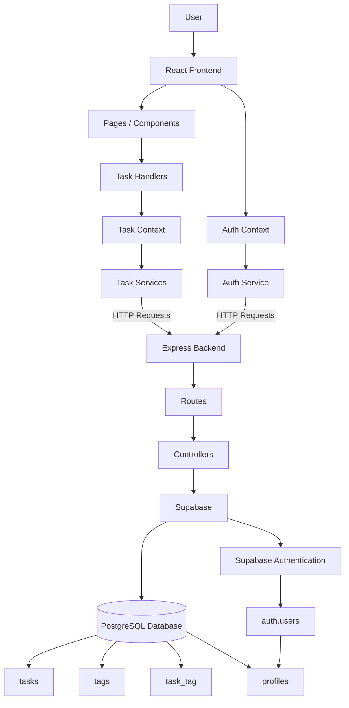
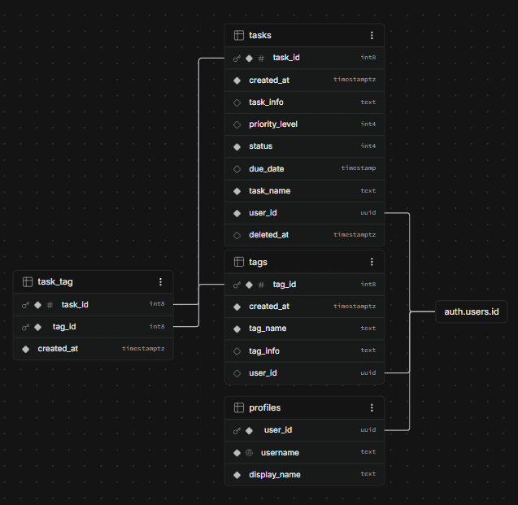

# Takda

Takda is a web-based task management application developed for **CMSC 128 – Software Engineering**. It helps students organize schoolwork, deadlines, and everyday tasks through task management, filtering, sorting, calendar views, and user accounts.

The application uses a React frontend, an Express backend, and Supabase PostgreSQL for persistent data storage.

---

## Features

### Task Management
- Create tasks with a title, description, due date and time, priority, and tags
- View and edit existing tasks
- Delete tasks with confirmation and undo recently deleted tasks
- Mark tasks as completed and update task status
- Search tasks
- Filter tasks by category, status, priority, and tag
- Sort tasks by title, priority, due date, and date added
- View tasks through a calendar
- Paginate task lists
- Persist task data across sessions
- Keep completed tasks visible with visual distinction

### Authentication & Account Management
- Register a user account with form validation and password confirmation
- Log in using either a username or email address
- Show or hide passwords through password visibility controls
- Maintain authenticated sessions across page refreshes
- Protect application routes from unauthenticated access
- Log out with confirmation
- View account information through the Profile page
- Update display name and username
- Change email address with confirmation
- Change password
- Recover forgotten passwords through email
- Access the Privacy Policy

### Notifications
- View task-related notifications
- Display task activity and relevant reminders through the Notifications page

### Appearance & Navigation
- Switch between light and dark themes
- Persist the selected theme
- Use responsive layouts across desktop, tablet, and mobile devices
- Navigate through a desktop sidebar or mobile bottom navigation

---

## Tech Stack

<p align="center">
  
  
  
  
  
</p>

<p align="center">
  
  
  
  
</p>

<p align="center">
  
  
  
  
</p>

### Technologies

| Layer | Technology | Purpose |
| --- | --- | --- |
| **Frontend** | React | Builds the user interface using reusable components |
| | Vite | Provides the development server and build tools |
| | Tailwind CSS | Provides utility classes for styling |
| | React Router | Handles client-side routing and navigation |
| | Axios | Sends HTTP requests to the backend API |
| | Lucide React | Provides interface icons |
| | Sonner | Provides toast notifications and user feedback |
| **Backend** | Node.js | Runs the server-side JavaScript application |
| | Express.js | Handles API routes and HTTP requests |
| | `@supabase/supabase-js` | Provides the JavaScript client for communicating with Supabase |
| | Helmet | Adds security-related HTTP headers |
| | express-rate-limit | Limits repeated requests to protect API endpoints |
| | CORS | Allows controlled communication between the frontend and backend |
| | dotenv | Loads environment variables from `.env` |
| **Database & Authentication** | Supabase / PostgreSQL | Stores persistent application data |
| | Supabase Authentication | Manages user accounts, authentication, and sessions |
| **Testing** | Vitest | Runs automated frontend and backend tests |
| | React Testing Library | Tests React components, hooks, and user interactions |

---

## Project Architecture
Takda follows a client-server architecture. The React frontend communicates with the Express backend through a REST API, while the backend uses Supabase for PostgreSQL data storage and user authentication.


```mermaid
flowchart TD
    A[User] --> B[React Frontend]

    %% Task flow
    B --> C[Pages / Components]
    C --> D[Task Handlers]
    D --> E[Task Context]
    E --> F[Task Services]

    %% Authentication flow
    B --> G[Auth Context]
    G --> H[Auth Service]

    %% Backend
    F -->|HTTP Requests| I[Express Backend]
    H -->|HTTP Requests| I

    I --> J[Routes]
    J --> K[Controllers]

    %% Supabase services
    K --> L[Supabase]

    L --> M[(PostgreSQL Database)]
    L --> N[Supabase Authentication]

    %% Application data
    M --> O[tasks]
    M --> P[tags]
    M --> Q[task_tag]
    M --> R[profiles]

    %% Auth identity
    N --> S[auth.users]
    S --> R
```

### Data Flow

**Task CRUD:** `User → React Components → Task Handlers → Task Context → Task Service → Express Routes → Controllers → Supabase → PostgreSQL`

**Authentication:** `User → Login / Signup → Auth Context → Auth Service → Express Auth Routes → Controllers → Supabase Authentication → Authenticated Session`

### Supabase Clients
The backend uses two Supabase clients depending on the operation:

- **Anon-key client** (`config/supabaseClient.js`) — Used for operations performed as a specific user, such as login, session refresh, logout, and email or password changes. These operations respect Supabase Row Level Security (RLS).

- **Service-role client** (`config/supabaseAdmin.js`) — Used for authorized task and tag operations and profile updates. The `requireAuth` middleware first verifies the user's identity, while controllers enforce ownership using the authenticated user's ID (`req.user.id`).
---

## Project Structure

```text
cmsc128-Lab1_CRUD_Sumergido-Tarre/
│
├── backend/
│   ├── config/
│   │   ├── supabaseClient.js
│   │   └── supabaseAdmin.js
│   ├── controllers/
│   │   ├── authController.js
│   │   ├── taskController.js
│   │   ├── tagController.js
│   │   └── userController.js
│   ├── routes/
│   │   ├── authRoutes.js
│   │   ├── taskRoutes.js
│   │   ├── tagRoutes.js
│   │   └── userRoutes.js
│   ├── utils/
│   │   └── validation.js
│   ├── app.js
│   ├── package.json
│   └── .env                  # local only; not committed
│
├── frontend/
│   ├── src/
│   │   ├── features/
│   │   │   ├── auth/
│   │   │   ├── calendar/
│   │   │   ├── notifications/
│   │   │   ├── profile/
│   │   │   └── tasks/
│   │   ├── layouts/
│   │   ├── pages/
│   │   ├── routes/
│   │   ├── shared/
│   │   │   ├── components/
│   │   │   ├── constants/
│   │   │   ├── context/
│   │   │   ├── services/
│   │   │   └── utils/
│   │   ├── App.jsx
│   │   ├── App.css
│   │   ├── index.css
│   │   └── main.jsx
│   ├── vite.config.js
│   └── package.json
│
├── .gitignore
├── README.md
└── package.json
```

---

## Installation

### Preliminary

Create a `.env` file in the `/backend` directory:

```env
PORT=5000
FRONTEND_URL=http://localhost:5173

SUPABASE_URL=your_supabase_url
SUPABASE_ANON_KEY=your_supabase_anon_key
SUPABASE_SERVICE_ROLE_KEY=your_supabase_service_role_key
```

- `SUPABASE_ANON_KEY` — used for user-scoped Supabase operations such as authentication.
- `SUPABASE_SERVICE_ROLE_KEY` — used for authorized backend operations that require elevated access. **Never expose this key to the frontend or commit it to version control.**
- `FRONTEND_URL` — used for authentication redirects such as password reset and email verification.

Do not commit the actual `.env` file or expose your credentials.

#### Supabase Dashboard Configuration

Configure the following settings in the Supabase Dashboard:

- **Authentication → URL Configuration → Redirect URLs** — add `<FRONTEND_URL>/reset-password` and `<FRONTEND_URL>/verify-email`.
- **Authentication → Providers → Email → Secure email change** — configure the required confirmation behavior for email changes.


### 1. Install Dependencies

Install the backend dependencies:

```bash
cd backend
npm install
```

Install the frontend dependencies:

```bash
cd ../frontend
npm install
```

### 2. Start the Backend Server

From the `/backend` directory:

```bash
node app.js
```

or:

```bash
npm start
```

The backend runs at `http://localhost:5000`.

> The backend does not use `nodemon`, so restart the server manually after code or `.env` changes.

### 3. Start the Frontend

From the `/frontend` directory:

```bash
npm run dev
```

The frontend runs at `http://localhost:5173`.

Open the frontend URL in a browser to use Takda.

---

## Testing

From the project root, run all automated tests:

```bash
npm test
```

Run the backend and frontend test suites individually:

```bash
npm run test:backend
npm run test:frontend
```

Check the frontend for linting issues:

```bash
npm run lint
```

Verify the frontend production build:

```bash
npm run build
```

The automated test suite covers backend controllers and frontend authentication, routing, services, task handling, validation, and utility behavior.

---

## API Endpoints

### Auth (`/api/auth`)

| Method | Endpoint | Auth | Description |
| --- | --- | --- | --- |
| `POST` | `/api/auth/signup` | Not required | Register a new account (`email`, `password`, `username`, `display_name`) |
| `POST` | `/api/auth/login` | Not required | Log in using a username or email and receive a session |
| `POST` | `/api/auth/logout` | Session token | Invalidate the current session |
| `POST` | `/api/auth/refresh` | Refresh token | Refresh an expired access token |
| `GET` | `/api/auth/me` | Required | Retrieve the current authenticated user and profile |
| `POST` | `/api/auth/forgot-password` | Not required | Send a password reset email |
| `POST` | `/api/auth/reset-password` | Recovery tokens | Reset the password using tokens from the recovery link |

### Tasks (`/api/tasks`)

| Method | Endpoint | Auth | Description |
| --- | --- | --- | --- |
| `GET` | `/api/tasks` | Required | Retrieve all tasks for the current user |
| `POST` | `/api/tasks` | Required | Create a task |
| `PUT` | `/api/tasks/:task_id` | Required | Update a task |
| `DELETE` | `/api/tasks/:task_id` | Required | Soft-delete a task |
| `PATCH` | `/api/tasks/:task_id/restore` | Required | Restore a soft-deleted task |

### Tags (`/api/tags`)

| Method | Endpoint | Auth | Description |
| --- | --- | --- | --- |
| `GET` | `/api/tags` | Required | Retrieve tags for the current user |

### Users (`/api/users`)

| Method | Endpoint | Auth | Description |
| --- | --- | --- | --- |
| `PATCH` | `/api/users/me` | Required | Update display name and/or username |
| `PATCH` | `/api/users/me/email` | Required | Change email address and send confirmation |
| `PATCH` | `/api/users/me/password` | Required | Change password |

---

## Database Schema / ERD
The database is hosted in Supabase and consists of four main tables:

- **`tasks`** – stores task information for each user
- **`tags`** – stores user-specific tags
- **`task_tag`** – connects tasks and tags
- **`profiles`** – stores each user's username and display name

The `task_tag` table manages the **many-to-many relationship** between tasks and tags. The `tasks`, `tags`, and `profiles` tables are associated with authenticated users through their user IDs.



### Main Task Fields

| Field | Description |
| --- | --- |
| `task_id` | Unique task identifier |
| `task_name` | Task title |
| `task_info` | Task description |
| `priority_level` | Task priority |
| `user_id` | UUID of the user who owns the task |
| `status` | Current task status |
| `due_date` | Task due date and time |
| `created_at` | Task creation timestamp |
| `deleted_at` | Soft-delete timestamp; `null` when the task is active |

---

## CRUD Operations

| Operation | Description |
| --- | --- |
| **Create** | Creates a new task |
| **Read** | Retrieves and displays the authenticated user's tasks |
| **Update** | Modifies task details or status |
| **Delete** | Soft-deletes a task after confirmation, with the option to restore it |

CRUD operations are handled through the Express backend and persisted in the Supabase database.

---
## Authentication
Takda provides account authentication and account management through the backend and Supabase Authentication.

### Registration
Users can create an account using a display name, username, email address, and password. The registration form validates required fields, email format, password confirmation, password strength, and duplicate account information before account creation.

Passwords must contain at least 8 characters, including an uppercase letter, lowercase letter, number, and special character. Password validation is enforced by both the frontend for immediate feedback and the backend for server-side protection.

Account authentication and password storage are handled through Supabase Authentication. Takda does not store plaintext passwords in the application database.

### Login
Users can log in using either their username or email address together with their password. Successful authentication creates a session and redirects the user to the Profile page.

### Session Persistence
Takda uses token-based authentication backed by Supabase sessions. After a successful login, the authentication session is restored when the application loads so that authenticated users remain logged in across page refreshes and normal browser navigation.

The frontend restores the authenticated user state using the stored session tokens and verifies the current user through the backend. Invalid or expired authentication data is cleared so that protected content can no longer be accessed.

### Protected Routes
Authenticated application pages are protected through `ProtectedRoute`. Users without an authenticated session are redirected to the login page.

Protected pages include:
- Dashboard
- Calendar
- Notifications
- Profile
- Settings

### Logout
Users can log out through the desktop navigation, profile menu, or Profile page. Each logout action uses a confirmation dialog before invalidating the session and returning the user to the public landing page.

### Profile Management
Users can update their display name and username from the Profile page. Changes are stored in the user's application profile and persisted in the database.

### Email and Password Changes
Users can change their email address and password from account settings. Email updates are validated before being submitted to Supabase, and confirmation behavior follows the project's Supabase email configuration.

New passwords are subject to the same password-strength requirements used during registration and password recovery. Password validation is enforced by the backend before the update is sent to Supabase.

### Password Recovery
Users who cannot log in can request a password-reset email using their registered email address. Supabase sends a recovery link that verifies the reset request and redirects the user to Takda's reset-password page with temporary recovery tokens.

The frontend reads the recovery access and refresh tokens from the redirect URL and sends them with the new password to the backend. The backend establishes the recovery session through Supabase and updates the user's password after validating it against the application's password policy. After a successful reset, the user can sign in using the new password and the previous password is no longer valid.

---
## Expanded Features

### Lab 1 - Task Organization
Tasks can be searched, filtered by category, status, priority, and tag, and sorted by title, priority, due date, or date added. The Calendar View organizes tasks by due date, while the Undo option allows recently deleted tasks to be restored.

### Lab 2 - User Accounts and Authentication
Takda extends the original task-management application with persistent user accounts through Supabase Authentication. Users can register, log in using either their username or email address, maintain authenticated sessions, manage their profile and account credentials, log out, and recover forgotten passwords through email.

Protected application routes prevent unauthenticated users from accessing account-restricted features.

---
## Data Persistence
Task data is stored in the Supabase PostgreSQL database rather than only in the browser, allowing tasks to remain available after page refreshes and backend restarts.

User accounts are managed through Supabase Authentication, while application-specific profile information is stored in the `profiles` table. Account and profile data persist across browser refreshes and backend restarts.

---
## HCI Considerations
Takda applies HCI principles through:

- Clear labels for task fields, account forms, and actions
- Consistent navigation and layout across application pages
- Visual distinction between task statuses and priorities
- Toast notifications for success and error feedback
- Confirmation dialogs before destructive or session-ending actions
- Search, filtering, sorting, and pagination for efficient task navigation
- Calendar-based task organization
- Password visibility controls for password fields
- Form validation with clear and understandable error messages
- Loading and disabled states during form submissions
- Clear indication of the user's authenticated state
- Immediate feedback after profile and account changes
- Responsive layouts for different screen sizes
- Persistent light and dark theme preferences

---
## Contributors
- **Gabrielle Sumergido**
- **Ma. Christie Jude Tarre**

---
## Course Information
**CMSC 128 – Software Engineering**

**University of the Philippines Visayas**

**1st Semester, AY 2026–2027**